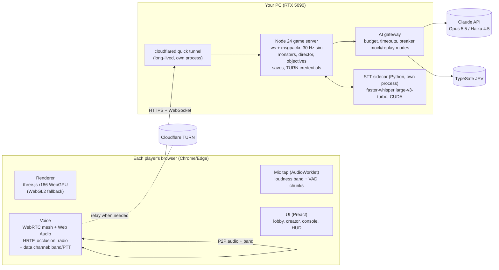

# DEAD AIR: build plan

*Co-op horror for 2–6 friends that runs in the browser, built tonight (Tue 6 Oct 2026) by Claude Code agents. "DEAD AIR" is a working title.*
*Build log (16:30): the build started at 15:40. P0 is done: contracts, skeleton (G0 green), STT on the GPU, AI checks, 47 MB of assets. The level track started early. P1 (net/render/voice/players) and P2 (objectives/interaction/monsters/meta/AI) now run **in parallel** in one shared working tree with strict file ownership (CLAUDE.md) instead of separate worktrees. Target: play at ~20:45.*
*Status: **plan v1.1**. v1 was reviewed by three independent agents (tonight feasibility, technical correctness, player fun; see [docs/research/plan-reviews.md](docs/research/plan-reviews.md)) and every critical and high finding is applied here. **I'm waiting for your "go" and the answers in [§11](#11-what-i-need-from-you).** The research behind this is in [docs/research](docs/research/README.md), and much of it was measured on your PC.*

## 0. TL;DR

| | |
|---|---|
| **The game** | You play a night-shift salvage crew. "The Company" sends you into procedurally generated facilities to grab loot and a priceless **Core** before the van leaves at 04:00. Something inside, **The Listener**, *understands what you say to each other*. It hears you exactly as far as your friends can, it acts on your callouts, and it can only speak through your radios. A blind **Hound** forces silence and bait. From Risk 2 on, the **Mannequin** joins: it only moves when nobody is watching it. |
| **Why it'll be fun** | The genre's hits each used one voice hook: monsters that hear your mic (Lethal Company), stolen voices (the Skinwalkers mod, MIMESIS) and voice as input (Phasmophobia). DEAD AIR uses all three, plus one no shipped game has: a monster that understands *meaning* and *shows* you what it understood ("INTERCEPT: '…meet in BOILER-2…'"). |
| **How** | A browser game (three.js r186, WebGPU), served by a Node server on your PC and shared as a link through a Cloudflare tunnel, so friends install nothing. Proximity voice runs over WebRTC. Your RTX 5090 transcribes speech locally with Whisper, about 50 ms per clip. Claude writes the missions, clues and HR memos. If your key checks out, JEV (TypeSafe's decision model) makes the Listener's split-second choices. |
| **Tonight** | If you say go at ~15:00: a host playtest at ~17:15, the game playable without AI at ~18:45, feature freeze at 19:30, play at ~20:30. Cuts trigger automatically at set times, so the evening is protected. |
| **Graphics, honestly** | Real-time shadowed flashlights, light shafts through dust, ambient occlusion, bloom, temporal anti-aliasing (TRAA), film grain and physically based (PBR) materials, with presets from Low up to 4K Ultra on your 5090. That's the best you can get *in a link you can send tonight*. Unreal-level fidelity would need a native build that friends download; that's the v2 path in §12. |
| **I need from you** | "Go", plus the §11 answers: two are needed now, the rest by 15:30 or 18:00. Ideally also a free Cloudflare TURN key by 15:30 (about 5 min of setup) so voice connects for every friend. |

## 1. The night, from a player's point of view

1. **Joining.** A friend clicks your link. Assets start streaming right away. One screen covers microphone choice, permission and consent. They land in the **van** in a dark parking lot wearing a random suit, and hear everyone positionally.
2. **Lobby.** In the van they can:
   - change their look at a **locker mirror**, where the others see the changes live;
   - learn the core rule at the **training kennel**, where a chained Hound behind a fence ignores whispers, turns at talking and lunges at shouting (this doubles as mic calibration);
   - set their screen brightness;
   - leave Discord voice when the banner says so, then press **Ready**.
3. **Work orders.** The crew picks one of three on the van's board: a site, its history, a memo from the Company, payout, risk, requirements. The drive (the loading screen) shows three one-line rule cards, one per monster.
4. **22:00, on site.** One player may stay at the **van console**: the only full map, security doors, the vault code, monster blips, a built-in radio and an **intercept log** of what the Listener heard. The field crew salvages loot, restores power with the twin breaker levers, opens the vault, carries the Core out between two people, and outwits the monsters. **03:00 blackout. 04:00: the van leaves.** You can leave early once every living player is inside.
5. **Results** (instant): scrip, XP, a death card for each death ("HOUND heard your SPRINT, 9 m"), and "it heard X → it did Y" lines from the Listener's log.
6. **Shop**, then the next work order. After three contracts the **shift quota** is checked, and Claude writes the **Company Performance Review**: an HR memo for each player that quotes the dumbest thing the Listener overheard. You're either promoted or you get a personal **termination letter**; the run resets, but levels and cosmetics stay.

## 2. Design pillars

1. **If a friend can hear you, so can it.** One loudness rule drives both proximity voice and monster hearing. It's fair and easy to read.
2. **Nobody survives alone.** Every core objective needs two or more people. Information is split: the console has the map and the codes, the field has the hands. The Listener only grabs someone with no teammate nearby.
3. **It hunts information, not noise.** The Listener acts on callsigns, names, digits and plans. Laughing and small talk only register as loudness. The van is sealed and safe to talk in. Talking is necessary and dangerous, but never forbidden.
4. **Every night is different.** Procedural sites, work orders and clues written by Claude, a pacing director, and a Listener that adapts to *your* crew.
5. **Darkness first.** Lighting, fog and sound carry the horror and make browser graphics punch above their weight, with a brightness check so nobody plays blind.
6. **Dying is funny.** Deaths are telegraphed and explained, and after a kill the threat backs off so the crew can laugh about it. The dead keep heckling, and HR files a memo.

## 3. Game design spec

Every number lives in `config/balance/<domain>.json`, one file per owning track, combined by a loader and hot-reloadable between contracts. Every feature has a flag in `config/flags.json`, so a cut or a live disable is a config flip.

### 3.1 Voice is gameplay

**Loudness bands.** An audio worklet on each speaker's own mic measures them, relative to that speaker's own talk baseline. The baseline is tracked continuously from their real speech (mostly van chatter), so a shy calibration doesn't matter.

| Band | Detected as | Audible and hearable radius |
|---|---|---|
| silent | below the gate (set from that player's own whisper level) | n/a (see the hold rule below) |
| whisper | baseline − 10 dB or lower | 3 m |
| talk | around baseline | 10 m |
| shout | baseline + 8 dB or higher | 25 m |
| scream | baseline + 16 dB or higher, sustained for 300 ms or more | 35 m |

The band thresholds use 2–3 dB hysteresis and a 200 ms hold. The whisper and shout prompts in calibration are optional; the defaults are −10 and +8 dB.

- **Distance is measured as a path** through the level: around walls, through doorways, with closed doors costing extra. It uses octile steps, so a diagonal step counts as about 1.41 m rather than 2. The server computes it once with the same shared function the monsters use, and sends each client a per-speaker path distance in every snapshot.
- **The 1:1 rule:** a client plays a speaker's voice only if their path distance is within that speaker's current radius. Monsters use exactly the same check. The band and the radio push-to-talk flag travel peer to peer on a WebRTC data channel, so they arrive together with the audio. When a speaker goes "silent", the receiver keeps their last radius for 1.5 s, and never mutes below whisper while the audio still has energy. No clipped first syllables.
- **The HUD meter** shows your own live band.
- **The van cab is sealed.** Voices inside it are heard only inside, by players and monsters alike. That's where you can talk freely.
- **Walkie-talkies:** the crew gets two company walkies at the start of each shift, more cost scrip. Hold `Q` to transmit. Radio audio is band-passed, crunchy and squelched. *(Flagged, after G2:)* a receiving walkie also **leaks** audio to anyone nearby at 0.6× the radius, so the operator's callout can give the field team away.
- **Footsteps and actions** have noise radii: crouch 1.5 m, walk 5 m, sprint 12 m, door 6 m, security door 12 m, dropped Core 15 m, bottle 15 m, failed lever alarm 20 m.
- **No mic, or on speakers:**
  - A friend without a mic can use **proximity text**: typed lines appear to anyone within talk radius and reach the Listener the same way speech does.
  - If the echo self-check fails (speakers), push-to-talk (`V`) is forced on and a badge shows it.

### 3.2 The Listener (signature monster, AI-steered)

- **What it is:** a tall, faceless figure with a too-long neck and its head always cocked, mostly seen in glimpses. It speaks only through radios and intercoms.
- **Perception:** it hears exactly what a teammate standing where it stands would hear.
  - It gets transcripts of speech within each speaker's radius, tagged with who said it and from which room.
  - Players who opted out of transcription register as loudness only.
  - **Sight:** a 90° cone. It sees you at 8 m if you're lit (your flashlight is on, you're in a lit room, or there's a glowstick within 2 m), and at 3 m in the dark. Walls block it.
  - It never knows player positions it didn't hear or see.
- **It hunts information, not noise.** Only transcripts containing callsigns, player names, digits or plan words ("meet", "go", "wait", "vault", "code"…) can start an ambush, stalk or lure. Everything else is just loudness.
- **Dormant start (Risk 1):** for the first 3 minutes it only listens. Then the whole facility flickers, every walkie squelches, and it *immediately* acts on something it overheard. That's the moment players realise it understood.
- **Brain (AI):**
  - At most once every 3 s, and only when there's new meaningful input, the server asks for an **intent**: `investigate_room`, `ambush_room`, `stalk_player`, `radio_lure`, `retreat` or `ignore`, with a target and a memory note of 8 words or fewer.
  - The server **validates** that the target could be inferred from what it heard: the callsign was spoken (via a fuzzy normalizer, so "boiler two" matches BOILER-2), the doorway the sound came through, or a name it heard. It can't cheat or be talked into omniscience.
  - **Who decides:** JEV first, if healthy. Then Claude Haiku 4.5, timed out at the measured p90 + 300 ms. Then a rule brain (normalized keyword match plus loudness), which always works.
- **Telegraph (so it reads as understanding, not randomness):** when an intent comes from a transcript, the lights in the target room flicker for 1.2 s, walkies within 20 m squelch, and the console prints `INTERCEPT: "…BOILER-2…"`. Vent travel is audible at the grates it passes.
- **Grab:** it only grabs a player who has **no living teammate within 8 m**. The victim dies after 3 s unless a teammate hits it (crowbar) or shoves it (`E`). The lesson players learn: never go alone, and verify radio calls.
- **Radio lure:** fake transmissions through a walkie or a room intercom. Tonight these are static plus garbled half-voices. *(Flagged stretch:)* a short real clip of a teammate who opted in, kept in RAM only.
- **Tells:** no push-to-talk click before its transmissions, the walkie LED flickers red, and the fluorescent hum shifts pitch when it's near.
- **Counterplay:** whispering, code words, deliberate lies (send it to an empty room you named), checking radio calls, flashlight signals, the sealed van.

### 3.3 Other monsters (rule-driven)

| Monster | Behaviour | What it forces | Counter |
|---|---|---|---|
| **Hound** (blind; every Risk) | **Ignores** anything below talk level (whispers, crouch steps). The first sound it hears puts it on **Alert**: a 1.5 s head tilt and a growl audible at 10 m (the "everyone freeze, *shut up*" moment). Then it investigates *the doorway the sound came through* at 4 m/s. It **charges** (7.5 m/s, kills on contact after a 300–600 ms wind-up) only if a second noise comes within 6 s and within 12 m. It loses interest after 10 s of quiet. Bottles override everything. One per contract, plus one more at 5–6 players on Risk 2 or higher. | Silence at the right moments, a designated noise-maker | Freeze when it growls, whisper, crouch-walk, throw a bottle |
| **Mannequin** (Risk 2+, or the crew's 3rd contract) | Frozen while any living player sees it **and it's lit** (fixture, flashlight cone, glowstick or flare radius), within 30 m. Unseen, it moves at 7 m/s and kills on touch. Each player's visor "blinks" (a visible 0.35 s dark frame with a click) every 18–30 s on that player's own timer, so two watchers are safe and one is risky. With 2 players, it spawns at least 25 m from the Core when the Core is lifted. Clients report "I see mannequin X" every tick; the server combines the reports. | Dedicated watchers, light management after the blackout | Two people watch it, back away together, glowsticks |
| *Later:* the Snatcher (punishes isolation), the Dimmer (lives in the dark), a visual mimic (wears a dead teammate's suit) | | | |

**After every death** the director treats the moment as a peak: the killer and any monster within 25 m leave play for about 20 s, and the Hound plays its eating clip on the body. Laughing at a death is safe.

### 3.4 Contracts and objectives

- **Loot budget** per contract: 650 × risk multiplier × player multiplier, weighted toward deeper rooms. Small items are worth 8–35 scrip, medium 35–90, heavy 150–300. Fragile items lose 10% per hard impact. Loot counts once it's in the van. A competent Risk-1 crew extracts about 400.
- **Power → vault → Core** (the big bonus):
  1. **Twin breaker levers:** at least 18 m apart with no line of sight between them, pulled within 1.0 s of each other. This powers the zone's lights and keypad. A failed pull sounds a 20 m alarm and starts a 20 s cooldown.
  2. **Vault keypad:** the 4-digit code is shown only on the van console (or split across two clue notes). Someone has to read it out.
  3. **The Core** sits in the deepest room and is worth 300–500. It **needs two carriers**, who move at 55% speed and keep free look. Dropping it costs 15%.
- **Keycard zones:** one locked wing at most on Risk 1–2. The key is always in an earlier zone, so every level is solvable.
- **Security doors:** 2–4 sit at chokepoints, and the operator opens and closes them from the console (5 s cooldown, 12 m clank). An optional intercom beep in any room works as a Hound decoy (30 s cooldown).
- **Company Requests** (tonight: `ALL_SURVIVE`, `EXTRACT_ABOVE x`, and one talk-positive request like `LURE_IT_WITH_A_LIE`: it investigates a room you named while nobody is there). Each is worth +50 to +150 and checked by the server.
- **Clock:** 15 real minutes, 22:00 → 04:00. Horn at 03:30. **Blackout at 03:00.** **The van departs at 04:00**; anyone not inside is lost, badge included. A **leave-now lever** in the van ends the contract early once every living player is in.
- **HUD checklist:** power ☐ vault ☐ Core ☐ salvage x / y.

### 3.5 Items, shop and controls

| Item | Price | Notes |
|---|---|---|
| Flashlight | free | Everyone has one; `F` toggles it; the battery drains |
| Walkie-talkie | 40 (2 free per shift) | Radio channel |
| Crowbar | 30 | `LMB` swing: frees a grabbed teammate, pries jammed doors (loud) |
| Bottles ×3 | 15 | `LMB` throw: 15 m noise, Hound bait |
| Glowsticks ×5 | 10 | Light markers (emissive only); keep the Mannequin "lit" |
| Medkit | 45 | Revives a teammate where they fell, within 30 s, at 50% HP (consumed) |
| Airhorn (joke loot) | — | Worthless, hilarious, and sets off the Hound |

Tonight the shop sells only these. Higher-tier gear is in §12. **Controls:**

| Action | Key |
|---|---|
| Move | WASD |
| Look | mouse (pointer lock) |
| Sprint | Shift |
| **Crouch** | **C** (hold, toggle in settings) |
| Use / throw / swing | LMB |
| Interact / carry / hide | E |
| Flashlight | F |
| Walkie | Q |
| Optional push-to-talk | V |
| Emotes (wave, point, beckon, thumbs-up) | T |
| Silent ping, seen only by teammates with line of sight | MMB |
| Drop | G |
| Inventory slots | 1–4 |
| Menu, including a one-screen "how to play" | Esc |

**No Ctrl combinations, ever:** Ctrl+W closes the browser tab. A "Leave the shift?" confirmation guards accidental closes. **Room light switches** (`E`) are a real choice: a lit room lets you watch the Mannequin, but the Listener can see you there from 8 m. **Hiding:** press `E` at a locker to look out through the slats. A monster that loses you checks hiding spots with probability 0.35 and listens for 4 s; any voice above a whisper gives you away.

### 3.6 Progression, economy, requirements

- **Shift (3 contracts):** start with 150 scrip.
  - The first quota is 500 × the player multiplier (2p 0.75, 3p 0.88, 4p 1.0, 5p 1.12, 6p 1.25).
  - Each later quota is the previous one + 275 × (1 + n²/10) × U(0.85–1.15).
  - The quota counts **scrip hauled this shift**. Purchases and the 10% fine per unrecovered badge come out of the spendable balance only.
  - Overtime bonus: 20% of whatever you haul above the quota.
  - Missing the quota gets you **fired**, with a termination letter.
- **Career (tonight):** a persistent XP total and level per player (thresholds 0 / 150 / 400 / 750 / 1200 / 1800 / 2600). Levels unlock **cosmetics** (helmets, glyph colours) and **risk tiers**.
  - **Requirements:** Risk 2 needs a crew-average level of 2 or more, *or* the "Core Business" achievement (extracting a Core).
  - Higher risk gives more loot (×1.0 / 1.4 / 1.9), more monsters (the Mannequin joins) and darker sites.
  - *Deferred (§12):* gear tiers, per-item unlocks, gear requirements, Risk 3, more achievements.
- **Persistence:** crew saves go in `saves/crews/<code>.json` and player profiles in `saves/players/<id>.json`. Both are written atomically.
- **Identity across sessions:** the quick tunnel gets a new web address each night, so browser storage resets. To keep their progress, each player gets a **claim code** (badge number + 4-digit PIN) shown in the creator. A returning player types name + PIN in the lobby to get their profile back.

### 3.7 Death, spectating, revive, failure

- Hound and Mannequin kills are instant but telegraphed. A Listener grab gives a 3 s rescue window.
- **Death card** (4 s): who killed you and why. The server already knows the perception event, e.g. "LISTENER heard 'meet in BOILER-2' from Sam's walkie, 40 s ago".
- The dead become **Static**:
  - The camera follows living teammates (click to cycle; free cam optional).
  - They hear the living with normal proximity at the camera, and all dead players in 2D.
  - *(Flagged, after G2:)* every 20 s they can push one burst of static through a walkie (audible at 6 m; it attracts the Hound).
- **Revive:** use a medkit where the player fell (within 30 s), or carry their badge back to the van to respawn them there after 20 s.
- **Wipe:** the crew loses only that contract's loot and carried gear. Bodies stay where people died.

### 3.8 Character creation (tonight's scope)

Faceless contractors, so there's no facial animation and no uncanny valley. Glowing visors tell friends apart in the dark.
- **Tonight:** name, suit primary/secondary colour, helmet (dome, plus box and diver as level unlocks), visor glyphs (up to 3 characters, emissive, colour picker), claim code. Edited live at the locker mirror in the van, on a male/female mannequin base (Quaternius UAL rig, CC0).
- **Deferred:** body sliders, suit materials, accessories, squelch tone.
- **Asset hygiene:** UAL clips carry scale and position tracks on every joint. Strip the scale tracks, and the position tracks except root and pelvis, at load time; check the female base's rest pose visually.

### 3.9 Procedural sites

- **Starting point:** the research prototype (`docs/research/prototypes/procgen`). It's a 1 m grid with thin walls, a corridor lattice (loops are guaranteed), rooms cut by BSP, doors, fire doors, rubble, nested keycard zones and an edge-grid A*/line-of-sight/sound flood. It was tested at 64×48 m (~140 rooms; 1000/1000 seeds valid; 1.6 ms).
- **Still to add tonight:**
  - speakable callsigns
  - van spawn at the entrance
  - vault room with keypad and Core
  - clue-note slots
  - security-door chokepoints
  - a line-of-sight check for lever placement, with a hard failure and seed retry if the levers can't be placed
  - octile path distance
- **Retune:** 12–24 rooms. The footprint scales with crew size: about 32×24 m at 2 players, 40×30 m at 4, 50×36 m at 6. At most one keycard lock. Bigger rooms, more halls.
- **Tests:** extend the 1000-seed test with these invariants at the new footprints.
- **Callsigns:** stencilled on walls and shown on the console, chosen to **differ by a whole word**, not a digit: `BOILER`, `COLDROOM`, `CHAPEL`, `MORGUE`, `DOCK`, `ARCHIVE`… They double as speech-recognition hotwords and as grounding for the Listener. One shared normalizer handles case, digits, number words and edit distance 1; it's unit-tested on 20 transcript variants per callsign.
- **Who generates:** the server generates the layout and sends it as JSON. The level generator track publishes **layout v1 fixtures for 5 seeds within 30 minutes of P1 start**, so every other track builds on real data.

### 3.10 Pacing director

The director runs a deterministic tension model per player (like Left 4 Dead's), cycling build-up → peak (3–5 s) → fade → relax (30–45 s), plus an "Alien: Isolation" retreat when menace peaks or after a death. Every 20–30 s it lists the allowed events: flicker, door slam, Hound relocation, Mannequin relocation out of view, fixture failure, radio static, quiet period. JEV can bias the choice; otherwise it's a weighted random pick. No Claude call: Haiku is too slow for this budget and wouldn't be noticeable.

### 3.11 Player-count scaling (2–6, lobby cap 6)

- **Quota and loot:** scaled with player count (multipliers above).
- **Map size:** the footprint grows with the crew (§3.9).
- **Operator:** optional at 2–3 players; anyone can walk back to the console.
- **Monsters:** a second Hound at 5–6 players on Risk 2 or higher.
- **Mannequin:** with 2 players it spawns at a safe distance.
- **Roles:** soft, never locked.

## 4. Architecture

### 4.1 Why the browser (and what we give up)

| Option | Verdict for tonight | Why |
|---|---|---|
| **Browser: three.js r186 WebGPU + Node host** | ✅ **Build this** | Friends join from a link with nothing to install, proximity voice is built into browsers, keys stay on your PC, and agents can test it headlessly on your 5090 (verified). |
| Godot 4.7/4.8 native + GodotSteam | v2 candidate | A higher lighting ceiling, plus Steam invites and voice. But friends must download an unsigned exe, and peer-to-peer can't be tested on one PC. Godot's *web* export is WebGL2-only, which looks worse than three.js on WebGPU. |
| Unity 6.6 | ✗ | 9 GB install, sign-in, slow builds; its proximity voice (Vivox) has no positional mode on web. |
| Unreal 5.8 | ✗ | Best graphics, but a ~70 GB install, binary Blueprints and long cooks. Not without a human working in the editor. |

The server is a standalone **"game brain"** behind a plain WebSocket protocol, so a native v2 client can reuse all of it.

### 4.2 System diagram



### 4.3 Stack (pinned) and code rules

| Layer | Choice |
|---|---|
| Language | TypeScript everywhere. Node 24 runs `.ts` directly (type stripping). Root tsconfig: `verbatimModuleSyntax`, `erasableSyntaxOnly`, `allowImportingTsExtensions`, `noEmit`, `module`/`moduleResolution: nodenext`. **`import type` for every type import.** Without it, `tsc` passes but Node crashes at load time (reproduced on this PC). `"type": "module"` in every package.json. Never `--preserve-symlinks` or install-links. No ESLint tonight (it needs the old TypeScript API); we use tsc + greps. |
| Client | `three@0.186.1` (`three/webgpu`, `three/tsl`, `three/addons`). Vite 8.3.3 with **`build.rolldownOptions.output.keepNames: true`**, which DynamicLighting batching needs. Preact + signals for the UI. |
| Server | Node 24.14, `ws@8.22.0` (maxPayload 256 KB), `msgpackr@2.1.0`, `zod` 4, `@anthropic-ai/sdk@0.131.0`, `@typesafe-ai/sdk@0.6.0` (JEV, optional), `flatqueue`, `sirv`. |
| Speech-to-text | Python 3.13 venv: `faster-whisper==1.2.1`, `ctranslate2==4.8.2`, **`av==16.1.0`**, `nvidia-cublas-cu12` (DLL path set at runtime). Fallback: `onnx-asr==0.12.0` Parakeet v3 on CPU. |
| Tunnel | `cloudflared` 2026.10.0 portable exe, `--metrics 127.0.0.1:20241`. Tailscale Funnel as backup. |
| Voice relay | Cloudflare Realtime TURN, credentials minted per join with a 24 h TTL. |
| Assets | **native** `gltfpack.exe` 1.3 (KTX2/WebP), `@gltf-transform/cli@4.5.1`. Content-hashed file names plus a manifest. |
| Tests | `playwright-core@1.63` with `channel:'chrome'`, headless, real GPU; the Node test runner; `pixelmatch`; ws bots. |

P0 installs **every** dependency for the night. Tracks don't edit package.json or the lockfile; they ask the integrator.

### 4.4 Repository, ownership and contracts

```
theboys/
  PLAN.md · CLAUDE.md (agent rules, ownership matrix, forbidden APIs)
  .env (server-only, gitignored, never copied into worktrees; loaded via --env-file by absolute path)
  config/flags.json · config/balance/<domain>.json
  packages/shared/src/
    envelope.ts       FROZEN in P0: ops, Hello/Welcome/Pose/Snapshot/Event/Req/Reply/Signal, quantization, version
    messages/<track>.ts, state/<track>.ts   each track owns its own message and state schemas (zod); additive-only changes
    layout.ts · profile.ts · saves.ts · workorder.ts · interactables.ts · anim.ts · assets.ts (keys + placeholder fallbacks)
    constants.ts · callsign.ts (normalizer) · test-api.ts
    procgen/ nav/ collide/ rng.ts
  apps/client/src/  main.ts · world.ts (entity store) · systems.ts (fixed update order) + one folder per track
  apps/server/src/  index.ts · sim.ts (registerSystem / registerReq) + one folder per track
  services/stt/ · tools/ · tests/ · saves/ · logs/ · docs/research/
```

- **Shared data root:** `C:\Users\Pieter\repos\theboys` holds `.env`, `.assets/`, `tools/*.exe`, `services/stt/.venv` and the model cache. Every worktree points at them by absolute path through env vars (`ASSETS_DIR`, `TOOLS_DIR`, `STT_URL`).
- **Ports:** PORT, BASE_URL and STT_URL come from the environment. Worktree *n* uses port 3000+*n*. Only `main` runs on :3000, which is where the tunnel points.
- **Changing shared contracts mid-phase:** additive only, merged by the integrator; every track then rebases.

**Ownership matrix** (who builds what):

| Track | Owns |
|---|---|
| **Skeleton** (P0) | client/server shells, systems registry, Preact overlay with HUD slot API, Playwright launcher (one fake-mic WAV per process, BASE_URL), CI greps, `--selftest` boot checks |
| **① Net** | WebSocket server/client, crews and codes, tick, snapshots, resume/session persistence, invite link, **per-listener path distance per speaker in snapshots** |
| **② Level** | generator, layout v1 fixtures, level mesh builder, materials, collision, callsigns, van and lot set piece |
| **③ Render** | renderer, post stack, light pools, presets, WebGL2 path, stress scene |
| **④ Voice** | mesh, TURN, data-channel band/PTT, Web Audio chain, mic tap, **VAD chunk streaming** (consumed later by speech-to-text), calibration, echo check, `/voicetest` page, `sfx.play(id, pos)` API, radio chain |
| **⑤ Players** | first-person controller, action map (with test `setInput` and a pointer-lock bypass), camera, local flashlight pose, footstep noise events, remote avatars (capsules first, UAL rig once assets land), anim enum, emotes and ping |
| **P2 (a) Objectives** | levers, keypad/vault, Core carry, extraction and leave-now lever, clock and blackout, Company Requests, clue notes in the world, **the contract bot** |
| **P2 (b) Interaction** | interactable registry, items and inventory, doors, lockers, hiding, light switches, walkies, death/spectate/revive, death cards, dead-voice channel |
| **P2 (c) Monsters** | perception (sound flood, sight), Hound, Mannequin, Listener body and rule brain, telegraphs, the deterministic director |
| **P2 (d) Meta** | van hub (board, shop, ready check, kennel, locker mirror, brightness check), results, quota, XP, saves, claim codes, console map and intercept log, the basic creator |
| **P2 (e) AI and speech** | STT bridge, AI gateway (mock/replay/live, budget), routes for briefs and reviews |
| **P3** | Listener brain wiring, who-heard-what, polish, playtest fixes |

### 4.5 Networking

- **One authoritative Node process** on `127.0.0.1:PORT` serves `apps/client/dist` and `.assets/dist` only. Dotfiles are denied, and `/.env`, `/saves`, `/logs` and `/.git` return 404 (tested in G4).
- **Tick:** a 30 Hz fixed step, using a `performance.now()` accumulator woken by `setTimeout(…, 1)`. Snapshots go out at 20 Hz.
- **Movement:** clients own their own movement and send it at 20 Hz. The server clamps speed, rejects walking through walls, and owns everything else. Clients also send loudness events from the worklet port (not the render loop), so they keep flowing when someone alt-tabs.
- **Sync:**
  - A reliable event stream, plus snapshots that each replace the previous one.
  - Full state on join or resume.
  - Remote entities are interpolated 80–250 ms behind, adapting to jitter.
  - Monster attacks wind up for 300–600 ms, so lag never decides a death.
  - Snapshots are skipped for any socket with more than 64 KB waiting to send.
- **Resilience:**
  - The server pings every 20 s; idle tunnel sockets die at 125.7 s (measured).
  - cloudflared and the speech-to-text sidecar run as **separate long-lived processes**. `npm run host` re-attaches if they're already running. `npm run server:restart` restarts only the game.
  - The crew roster, phase and resume tokens persist to `saves/session.json` on every change. Peer IDs come from a hash of the player key, so voice links survive a server restart.
  - **Live restarts happen only during the van phase.** A restart mid-contract sends everyone back to the van and voids the contract with no penalty.
- **Lobby and host admin:**
  - The crew code goes in the URL hash and is sent in the first message, never in the URL.
  - Unknown crew codes are rejected.
  - The host gets an **admin token**, printed at startup and set automatically in your localhost tab. It's needed for crew creation, kick and debug.
  - Debug and test opcodes only exist with `NODE_ENV=development`.
  - Stale clients get a reload prompt.
- **Bandwidth:** game state is about 50–60 kbps per client. The first asset load is the real cost, because the tunnel doesn't cache; it targets 60 MB or less, with at most 6 parallel requests per client.

### 4.6 Voice pipeline

- **Topology:** a WebRTC full mesh, audio only, plus one unreliable data channel per pair carrying band and push-to-talk at about 20 Hz. Signalling runs over the game WebSocket using perfect negotiation. 6 players means 15 links at about 55 kbps each.
- **Getting through firewalls and NAT (TURN):**
  - The server mints credentials (24 h TTL), filters out `:53` URLs, and includes `turns:443`. Peers restart ICE when a connection fails.
  - Expect roughly 1 in 5 friend pairs to need the relay.
  - The lobby shows a direct / relay / failed badge per friend.
  - **G1 includes an automated relay-only test**, so the TURN path is proven by about 16:30, not at 19:30.
- **Playback chain per remote voice** (one AudioContext, created on Join):
  1. A muted keep-alive `<audio>` element (mandatory: Chrome bug 40094084, still present in Chrome 154).
  2. `MediaStreamSource`.
  3. Occlusion lowpass + gain.
  4. **PannerNode** with HRTF and rolloff 0, used for direction only.
  5. Gate/distance gain, driven by the server's path distance against the speaker's radius from the data channel, smoothed with `setTargetAtTime`.
  6. Receiver-side makeup gain from the speaker's calibrated talk level, which normalises loud and quiet mics.
  7. Per-voice gain, then the bus, a compressor, and the output.

  Alongside that run one shared reverb send and a separate 2D radio chain. The self-healing fallback (a plain `<audio>` element when Web Audio goes silent) drives `element.volume` from the same gain, so the 1:1 rule still holds.
- **Capture:** `getUserMedia({deviceId, echoCancellation: true, noiseSuppression: true, autoGainControl: false})`. AGC squashes whisper and shout (measured). The code asserts the settings after setup and never uses `'remote-only'`. There's a device picker on the join screen and in settings. Chrome's echo cancellation does cover Web Audio output (verified), but headphones are still strongly recommended, and a failed echo check forces push-to-talk.
- **Mic tap (AudioWorklet):** computes the band and runs VAD. For players who consented, it streams **100 ms PCM chunks** (16 kHz Int16, 3.2 KB each) as binary frames `[op, segId, seq, pcm]` with 300 ms pre-roll, interleaved with poses. `segStart` and `segEnd` carry the maximum band, and segments are force-split at 10 s. If vad-web is used, override its stream hooks so it never re-acquires the mic.
- **Verify on Chrome 155.** It ships today, and our checks ran on 154, so the voice control test re-runs once the host's Chrome updates.

### 4.7 Speech-to-text sidecar (your RTX 5090)

- **Model:** faster-whisper `large-v3-turbo`, fp16, CUDA. **Measured on this PC: 47–69 ms per clip.**
- **Settings:**
  - Language fixed per lobby; if your crew mixes English with Dutch/Afrikaans, per-segment detection over that small set instead (about +40 ms).
  - Hotwords: callsigns in spoken form, plus player names.
  - `vad_filter=True` is mandatory (without it, 40/40 silence clips came back as "Thank you."); `condition_on_previous_text=False`.
  - Drop segments with `avg_logprob < -0.6` or `compression_ratio > 2.4`, and keep a blocklist of known hallucinations.
- **Fallback:** Parakeet v3 int8 on CPU.
- **Runs per speaker, on their own mic.** Never on the mixed audio.
- **Who heard what:** while a segment is open, the server collects every tick everyone and everything that could hear it (players, the Listener, receiving walkies), using the maximum radius so far, plus the speaker's room at onset. When the transcript arrives, it's attached to that set of hearers. Segments from dead speakers never reach the Listener.
- **Latency target, measured from your PC (speech end → Listener acts):** p90 ≤ 2.5 s with JEV, ≤ 4 s with Haiku.

### 4.8 AI gateway (Claude + JEV)

All AI goes through one server module:
- per-route timeouts, a circuit breaker (opens for 60 s after 2 failures), one call in flight per route
- **one global budget** ($5 per server process by default) and per-player rate limits
- a log at `logs/ai-usage.jsonl`
- `AI_MODE=mock|record|replay|live`

**Calling convention:** use `create()` / `stream().finalMessage()` with `output_config.format = {type: 'json_schema', schema}`. Not `messages.parse()`: it throws away the message on truncation, so you can't check `stop_reason`. Then branch on `stop_reason`:
- `end_turn`: run zod `safeParse` against a permissive schema, then enforce counts and length caps in code.
- `refusal`: log the category, retry on Haiku 4.5 (no classifiers), then fall back to the template.
- `max_tokens`: use the template.

Server-side fallbacks are **not** used tonight; on Opus 5.5 they only cover the cyber category.

| Route | Job | Model (confirm in §11) | Settings / budget | If it fails |
|---|---|---|---|---|
| `listener.intent` | action + target from what it heard | **JEV** `jev-1.13.0` → **`claude-haiku-4-5`** | Output is an enum, an ID and a note of 8 words or fewer; Haiku `max_tokens` ≈ 80. Timeout = measured p90 + 300 ms (likely 3–3.5 s). JEV client: `apiKey: JEV_API_KEY, defaultModel: 'jev-1.13.0', timeout: 900, maxRetries: 0`, options shuffled, debug logging off. | rule brain |
| `director.pick` | bias the allowed event | JEV only | ≤ 1 s | weighted random |
| `contract.brief` | site, history, memo, request flavour, 4–6 clue notes | **`claude-opus-5-5`**, effort medium, `max_tokens` 16000, streamed, prefetched one contract ahead. **Tonight's first contract always uses templates.** | Claude writes placeholders (`{{CODE_A}}`, `{{ROOM_1}}`). Code checks each appears exactly once, then substitutes real values, so **secrets never enter a prompt**. | template pack |
| `shift.review` | per-player HR memo + best quote, comments, termination letter | **`claude-opus-5-5`**, effort low, `max_tokens` 16000. One parallel call per player plus one for the comments and letter. **The template shows instantly**; Claude's text swaps in when ready (up to 60 s). Runs per **shift**, not per contract. | | template |

- **Why not Opus everywhere:** Opus 5.5 always thinks (this can't be turned off), so it takes about 8 s to the first token. The Listener needs a decision in about 2–3 s. Haiku 4.5 is listed as Active (its retirement floor is Oct 15, with at least 60 days' notice). Model IDs live in `.env`. If you'd rather have Sonnet 5.5 for the review, it's a one-line switch.
- **JEV:** almost certainly **Jev by TypeSafe AI**, a non-generative decision model in early access since 15 Sep 2026. It returns calibrated probabilities over up to 255 options in about 70–500 ms, plus about 175–220 ms of network time from your PC. It costs $0.042 per million input tokens. Your key's `apikey_` prefix isn't documented, so I need your OK for one free health check. If the check fails, JEV stays off and nothing breaks.
- **Tone:** PG-13 "dread, not gore", with corporate satire. The threat is supernatural: **never pathogens, chemicals, weapons or lab procedures**. That keeps Opus's bio classifier quiet and fits the game. The roast level (mild or spicy) targets in-game behaviour only. The lobby discloses that some content is AI-generated.
- **Prompt injection:** player speech is untrusted JSON data. The AI only chooses enumerated options, and code validates each choice. Secrets are never in prompts.
- **Cost:** about $1–4 per hour for the whole group; the cap makes a bug harmless. I recommend a dedicated workspace with a spend limit (§11).
- **Testing:** `ai:smoke` (every route returns `end_turn`), `ai:bench` (p50 and p90 from your PC), and a JEV check. All three run in **P0/P1, in the background**, so model choices are data-backed by 16:30. `npm run host` warms each schema's grammar with one real call.

### 4.9 Rendering and graphics

**Target look: darkness first.** Each flashlight casts real shadows through a projected pattern (a "cookie"), light shafts catch dust, fog fills the corridors, glowing signs and visors bloom, and film grain plus a horror colour grade sit on top.

- **Renderer and pipeline:** `WebGPURenderer`, which falls back to WebGL2 automatically; the HUD shows which backend is active.
  - **Post-processing stack:** a scene pass with normals and velocity, then ambient occlusion (GTAO, ½ res), volumetric beams (`VolumeNodeMaterial`, ¼ res, 8–12 steps), bloom, temporal anti-aliasing (TRAA), and film/CA/vignette/LUT.
  - **Exposure:** AgX tone mapping, height fog, and a minimum ambient light level so dark screens never go pure black. A one-time **brightness check** in the van sets exposure.
  - **Accessibility:** a "reduce flicker / chromatic aberration" toggle.
- **Flashlight pool:**
  - N shadowed `ProjectorLight`s with a procedural cookie, plus (6 − N) **unshadowed** SpotLights with an additive cone mesh. The unshadowed ones batch under `DynamicLighting({maxSpotLights: 8, maxPointLights: 16–32})`.
  - The shadowed slots are reassigned each frame to your own flashlight and the nearest or visible ones. **On/off and battery drain only change intensity.** Never add or remove shadowed lights or toggle `castShadow`: each recompile is a 74–210 ms hitch.
- **Fixture lights:**
  - A pool of point lights, clamped to the maximum every frame. Lights above the max are silently dropped.
  - Flares borrow from that pool. Glowsticks are emissive only.
  - Fixtures don't light the fog, so their halos are emissive sprites.
- **Texture sampler budget:** materials use at most 3 textures (a packed ORM shares one sampler), which leaves room for about 8 shadowed lights.
- **No hitches:** warm-up frames render on the loading screen with every light, character and material variant present. `compileAsync` alone misses the shadow and post passes.
- **Culling:** only rooms within 2–3 open doors of the camera are drawn. Room geometry is merged and props are instanced. No `BundleGroup` (it crashes with GTAO) and no `ClusteredLighting`.
- **Stress test:** a scene with 8 shadowed lights, a skinned suit with an emissive visor and the AO pass, on both backends. G1 fails on any WebGPU error.

| Preset | Shadowed + unshadowed flashlights | Shadow map | Volumetrics | GTAO | Res | Fixtures |
|---|---|---|---|---|---|---|
| Low | 2 + 4 | 512² | off | off | 0.75 | 8 |
| Medium | 4 + 2 | 1024² | ¼ res, 8 steps | ½ | 1.0 | 16 |
| High | 6 + 0 | 1024² | ¼ res, 12 steps | ½ | 1.0 | 24 |
| Ultra (your 5090 @ 4K) | 6 + 0 | 2048² | ½ res, 16 steps | full | 1.0 | 32 |

Presets are fixed tonight, chosen from the GPU name with a manual override; the auto-benchmark and dynamic resolution come later. Measured on your 5090 at 1080p, the full stack costs 0.38 ms of GPU time in a 300-mesh scene. The estimate for an RTX 3060/4060 with real assets is 5–10 ms.

Stretch goals (after freeze or later): SSR, SSGI/VXGI, TAAU dynamic resolution, motion blur, depth-of-field death cam, particles, and a "Retro" preset.

### 4.10 Assets and audio

| Need | Source (scripted; licence) |
|---|---|
| Surfaces | Poly Haven + ambientCG 2K PBR (CC0), at most 3 maps, world-space UVs |
| Props | Poly Haven 1K glTF (CC0), compressed with `gltfpack -cc -tc -tu normal` to KTX2 |
| Doors, lockers, vents, levers, keypads, Core, van | procedural geometry plus metal/paint textures |
| Bodies and animation | Quaternius **UAL1 v3** (itch.io free download, scripted, verified) + **UAL2** (OpenGameArt). Same 65-joint rig, CC0 |
| Mannequin / Listener | UAL mannequin mesh: porcelain for the Mannequin; elongated bones, zombie clips and wet skin for the Listener |
| Hound | Quaternius Zombie Apocalypse Kit **German Shepherd** (CC0, 11 clips including Eating), restyled dark and eyeless |
| Sound effects | Kenney (CC0), OpenGameArt rubberduck packs (CC0), Little Robot Horror Sound Library (CC-BY 3.0, credited) |
| Ambience | procedural Web Audio: drone, heartbeat, fluorescent hum, radio static, **one shared reverb** tonight |

`tools/fetch-assets.mjs` reads a manifest, downloads into `.assets/src`, optimizes into `.assets/dist`, and writes `credits.json`. It **starts in P0 and runs in the background**. Until assets land, placeholder fallbacks (capsules and flat materials) keep everything working.

### 4.11 UI flow

- **Join (one screen):** mic picker, permission, consent.
- **Van:** random suit, then the locker-mirror creator, the kennel calibration, the brightness check, the Discord banner, and per-player **Ready** (or the leader holds Drive for 3 s).
- **Board:** pick a work order.
- **Drive:** rule cards.
- **HUD:** checklist, clock, band meter, walkie LED, slots, stamina.
- **Console:** map, doors, code, blips for monsters within 6 m of a player, a SIGNAL SPIKE near the Listener, and the intercept log.
- **After the contract:** death cards and results. The HR memo comes per shift.
- **Settings and pause:** presets, exposure, mic device and gain, push-to-talk, volumes, sensitivity, flicker toggle, how-to-play.

### 4.12 Security and privacy

- **Secrets:**
  - They exist only in the server `.env`. `.gitignore` is committed before the first `git add`.
  - CI greps the client build for the **literal value of every `.env` entry**.
  - The server binds to localhost.
- **Public link controls:** crew code + optional password, admin token, kick, unknown codes rejected, one global AI budget, per-player rate limits.
- **Consent (per player):**
  - ① speech transcribed on the host PC, with text (never audio) sent to Claude/JEV;
  - ② *(stretch)* voice-clip mimicry, RAM only, off by default;
  - ③ an AI content disclosure.

  Opting out of ① makes you loudness-only.
- **Privacy toggle:** a "relay only" option hides your IP from peers.

## 5. Testing and verification

Agents can't play the game, so the tests act as their eyes. **Test controls** live in `test-api.ts` and the flags, available only in development:
- contract length override (3 min)
- monsters on / off / freeze
- pinned seed and spawns
- teleport and `setInput`
- a console-read call for bots
- `__voiceDebug` per peer: bytesReceived, rmsL, rmsR, distanceGain

**Fake-mic fixtures:** Windows SAPI WAVs at known whisper, talk and shout levels, plus spoken callsigns and names. The skeleton track generates them in P0.

**Gates** run as scheduled scripts on `main`. Each phase names one track as owner of its gate script, written at phase start:

| Gate | Pass criteria |
|---|---|
| **G0** | `tsc --noEmit`; forbidden-API and secret greps; `node apps/server/src/index.ts --selftest` and `node tools/gen-cli.ts --seed 1` boot; a WebGPU screenshot from headless Chrome; 2 WebSocket clients join one crew |
| **G1** | **Movement and render:** 3 Chrome clients through the tunnel each move at least 5 m with server-accepted poses. Flashlight-cone luminance is above a threshold, with 0 WebGPU validation errors, on WebGPU **and** `?webgl=1`. The stress scene passes.<br>**Voice:** a peer on the left gives rmsL − rmsR ≥ 6 dB. A peer beyond its radius stays below 0.001 RMS. **The relay-only TURN test** passes (selected candidate is relay, RMS above 0.01). |
| **G2a** | Monsters off: 2 bots finish a 3-minute contract (levers, vault, Core, extraction), and the crew save contains the haul |
| **G2b** | A fake-mic shout within 25 m path of the Hound puts it on alert, then investigating the correct doorway, within 1 s. A whisper does not. |
| **G3** | A WAV spoken at talk level 8 m from the Listener reaches its memory; at 15 m it doesn't. A decision is logged and acted on. The latency target holds. |
| **G4** | 4 Chrome clients + 2 bots finish a real-speed contract with 0 server exceptions, snapshots at 18 Hz or more, every voice pair above 0.01 RMS, the relay test green, and the `/.env`, `/saves` and `/.git` URLs returning 404 through the tunnel |

**Merging:** continuous. Tracks merge to `main` whenever their own tests pass, at least twice per phase. `main` stays green. Every green gate is **tagged**, and after the freeze we revert instead of debugging.

**Humans in the loop:**
- **~17:15 host playtest** (10 min): walking, flashlight, and voice bands against the meter; then tune.
- **~17:30 remote voice test:** you on your phone's mobile data, using the lightweight **`/voicetest`** page (no WebGPU or keyboard needed).
- **~18:50 solo contract** with bot teammates; then tune exposure, bands, Hound sensitivity and clock.

## 6. Build schedule for tonight

This assumes you say **go at ~15:00**. I'm the architect and integrator. Each phase is one parallel workflow with git worktrees, following the §4.4 ownership.

| Phase | Time | Tracks | Gate |
|---|---|---|---|
| **P0 Scaffold** | 15:00–15:45 | **Integrator:** contracts, CLAUDE.md, ownership matrix, flags/balance.<br>**Skeleton agent:** shells, overlay, test launcher, greps, WAV fixtures.<br>**Environment agent:** cloudflared, gltfpack, asset fetch (keeps running), STT venv + WAV→transcript test, JEV check, `ai:smoke`/`ai:bench` (all background) | G0 |
| **P1 Walk together** | 15:45–17:15 | ① Net · ② Level (fixtures by 16:15) · ③ Render · ④ Voice · ⑤ Players | G1, then host playtest + remote voice test |
| **P2 Something's in here** | 17:15–18:45 | (a) Objectives + bot · (b) Interaction · (c) Monsters + director · (d) Meta + console + creator · (e) AI gateway, STT bridge, brief/review routes | G2a + G2b, "we can play tonight", then solo contract |
| **P3 It understands** | 18:45–19:30 | Listener brain wiring, who-heard-what, telegraphs and intercept log, polish, fixes from playtest notes | G3 per feature (each behind its own flag) |
| **Freeze + harden** | 19:30–20:15 | Anything unmerged gets flagged off (the Listener falls back to the rule brain). 4-client real-speed soak, host runbook dry run. | G4, then ship |
| **Play** | ~20:30 → | I stay on for live fixes; game restarts only during the van phase. | |

**Time-triggered cuts:**

| When | Cut |
|---|---|
| **Now (already applied in this plan)** | mimic clip replay, CCTV, creator extras, shop above basic items, gear tiers, Risk 3, extra keycards, other Company Requests, auto-benchmark and dynamic resolution, SSGI, per-room reverb |
| **If G1 is after 17:30** | radio leak, dead static bursts, emotes and ping, proximity text |
| **If G2 is after 19:00** | the Mannequin (Risk 1 doesn't use it anyway), director events beyond flicker and door slam, Claude briefs (templates only) |
| **At 19:30** | hard freeze |

Whatever happens, **G2 gives you a playable co-op horror game with proximity voice tonight.**

## 7. Hosting runbook (tonight)

1. Run **`npm run host`**. It starts or re-attaches the STT sidecar and cloudflared (both long-lived), then starts the game server, waits until all three are healthy, and prints the invite link plus a **message ready to paste**:
   > "DEAD AIR tonight: open <link> in **Chrome or Edge**, use a **wired headset** (Bluetooth drops to call quality once the mic is on). Stay in Discord until you're in the van, then **leave Discord voice**: the game's voice is positional and the monsters hear it."
2. Friends join, land in the van, calibrate at the kennel, and Ready up. Once every badge is direct or relay, the lobby shows **"Everyone connected: leave Discord now."**
3. If a friend can't hear the others:
   - check their badge;
   - have them reload;
   - have them switch to Chrome;
   - run `/voicetest` for them.

   If the tunnel itself dies, use the prepared Tailscale Funnel link.
4. **Live fixes:** use `npm run server:restart`, only while the crew is in the van. Never restart cloudflared, because the link would change.
   - **Kill switches** (`config/flags.json`, e.g. gate P's order mirrors → paranormal → siteThemes): set the flag to `false`, then `npm run server:restart` in the van (SIGHUP also reloads the file where the OS can send it). The server applies it at once. Clients take the server's live flags from `/healthz` when the page loads, before anything installs, so have everyone **reload the page**. No client rebuild is needed. Client-side switches such as mirrors, volumetrics or gtao only change on that reload.
5. **Before the session:** disable sleep, use wired Ethernet if you can, and close heavy apps.

## 8. Not in tonight's build

- Native builds and Steam
- A physics engine (doors and carries are scripted)
- Synthesized Listener speech and mimic clip replay (both flagged stretch)
- Voice cloning
- Multiple floors and more themes
- Séance or AI-audience modes
- Gear tiers, Risk 3 and prestige
- Mobile and gamepad support

## 9. Risks and mitigations

| Risk | Mitigation |
|---|---|
| Scope overrun | Ownership matrix, frozen envelope, continuous merges, measurable gates, time-triggered cuts, freeze at 19:30, G2 playable without AI |
| **Crew goes silent** (two monsters punish voice) | "It hunts information, not noise"; sealed van; monsters back off after a death; talk-positive Company Request; the Hound ignores whispers; voice-activity logging per player to retune radii between contracts |
| Friends stay in Discord | Paste-ready invite text, a lobby banner, and a ready check |
| Voice fails for a friend | TURN proven by an automated test at G1, a human remote test at 17:30, per-friend badges, the keep-alive workaround + self-healing, `/voicetest` |
| First-timers get wrecked | Risk 1 = Hound + a dormant Listener, at most 1 keycard, the kennel tutorial, rule cards, a HUD checklist, death cards |
| AI feels random or omniscient | Server-validated targets, telegraphs, intercept log, "heard → did" lines, grab only when alone |
| AI latency, outages, refusals | Never on the per-frame path; measured timeouts; JEV → Haiku → rules; templates shown first; supernatural-only tone |
| Weaker friend PCs | Presets, unshadowed flashlight slots, culling, first load of 60 MB or less, a tested WebGL2 path |
| Tunnel or server restarts | Separate long-lived tunnel process, session persistence, peer IDs from the player key, restarts only in the van phase |
| Stale APIs from agents | Pinned versions, vendored r186 examples, Claude API skill, greps (Appendix B), `--selftest` boot checks |
| Public link abuse | Crew codes, admin token, debug opcodes only in development, a global AI budget, URL-access tests |

## 10. Requirements checklist

| You asked for | Covered by |
|---|---|
| Co-op horror like Phasmophobia / Lethal Company | §1, §3 (salvage + quota from LC, van console + a voice-reactive entity from Phasmo) |
| Sneaking | §3.1 noise rule, §3.2 Listener sight, §3.3 Hound alert/charge, §3.5 hiding and light switches |
| Required teamwork | §3.4 twin levers, code split, two-carrier Core, security doors; §3.2 grab-when-alone; §3.7 revives |
| Tasks and objectives | §3.4 salvage, power → vault → Core, keycard, Company Requests, leave-now |
| Progression, improvements, requirements | §3.6 quota, XP and levels, cosmetic and risk unlocks, Risk-2 requirement (gear tiers next session) |
| Auto-generated levels | §3.9 |
| AI (JEV + Anthropic) | §3.2, §4.8 Listener, director, briefs, HR memos |
| Proximity voice | §3.1, §4.6 |
| Invite friends online | §4.5, §7 |
| Character creation | §3.8 |
| Best possible graphics | §4.9, and §12 for native v2 |

## 11. What I need from you

**Needed now** (or just reply **"go, defaults"**):
1. **Go:** build DEAD AIR in the browser as planned. **(yes)**
2. **Git:** may I `git init` (with `.env`, saves and assets ignored) and make **local commits** at each green gate, never pushed? **(yes)**

**By 15:30:**

3. **Players and language:** how many tonight (2–6)? What language will you speak? **(English)** Mixing in Dutch or Afrikaans is fine; tell me. Everyone on **Chrome/Edge with a wired headset**? Mac users should use Chrome.
4. **Voice relay (strongly recommended, about 5 min):** create a free Cloudflare account, then go to dashboard → **Realtime (formerly Calls) → TURN → Create key** (`https://dash.cloudflare.com/?to=/:account/calls`). Add `CF_TURN_KEY_ID=…` and `CF_TURN_API_TOKEN=…` to `.env`. Without it, roughly 1 in 5 friend pairs may not hear each other. The dashboard might ask for a card (I couldn't verify); expected usage is about 4 GB of the 1,000 GB free tier.
5. **Spending:** an AI cap of **$5 per session**. Recommended: create a Console workspace "dead-air" with a monthly limit (e.g. $25), make a key in it, and use that as `ANTHROPIC_API_KEY`. The Default workspace can't have a spend limit.

**By 18:00:**

6. **JEV:** did your key come from TypeSafe (console.typesafe.ai)? May I run one free health check (`GET /v1/models`, no tokens)? **(yes; use it for the Listener and the director if it passes)**
7. **Models:** **Opus 5.5 writes (briefs, HR memos); Haiku 4.5 handles the Listener's real-time decisions**, because Opus 5.5 always thinks first (about 8 s). Or say Sonnet 5.5 for faster memos.
8. **Consent and tone:** will your friends be OK with on-PC transcription, with the text sent to Claude/JEV? Tone: **comedic corporate horror**. Roast level: **mild** or spicy?
9. **Tonight:** disable sleep, use Ethernet if you can, and be around at about **17:15** (10-minute playtest), **17:30** (phone on mobile data at `/voicetest`) and **18:50** (one solo contract).
10. **Optional keys:** Freesound, ElevenLabs, Tripo. **(skip tonight)**

### MCP tools and tooling

None are required: agents test with plain Playwright against your real Chrome and GPU, already verified on this PC. These would help:

| Tool | Value | How |
|---|---|---|
| **Claude Code update** (you're on 2.1.214) | newer MCP and Windows fixes | `claude update` |
| **chrome-devtools-mcp** (recommended) | Lets me drive and inspect the game interactively: console with source maps, performance traces, CPU throttling to mimic weaker PCs, and attaching to your real Chrome during playtests | PowerShell: `claude mcp add -s user chrome-devtools -- npx -y chrome-devtools-mcp@1.10.1 --headless --isolated --no-usage-statistics --no-performance-crux` (verified on your CLI) |
| **Context7** (recommended) | Current docs for fast-moving APIs (three.js TSL/WebGPU) | `npx ctx7 setup --claude` |
| Blender 5.2 + MCP for Blender, Meshy/Tripo/ElevenLabs | Asset work, AI monsters, vocals | later |
| Not needed | Unity, Unreal, Godot, GitHub or Cloudflare MCPs | |

New MCP servers load in a new Claude Code session. I can start without them. Your claude.ai Google Calendar and Drive connectors show as unauthenticated; they aren't needed here.

## 12. After tonight

- **v1.1:**
  - mimic clip replay
  - synthesized Listener radio lines (Kokoro, about 0.3 s per line on your CPU)
  - code-word cracking
  - gear tiers and the full shop (pro flashlight, flare, motion sensor, hand truck)
  - Risk 3 and achievements
  - the Snatcher and the Dimmer
  - a visual mimic
  - new themes (hospital, house, mine)
  - CCTV, terminal chat, a fuller creator, prestige
  - Rapier physics props
- **Stable hosting:** a named Cloudflare tunnel on your own domain gives a fixed link, so claim codes become unnecessary; or a small VPS near you.
- **v2 fidelity jump:** keep the Node game brain, add a **native Godot 4.8 client** (real-time global illumination, froxel volumetric fog, Steam invites and voice on your own $100 App ID), and keep the web version for zero install.

## 13. v1.2 cross-package API (every name exists from the contract commit; additive only)
### Server
- interaction/api.ts (G3): onItemEvent -> G4, G6, G2 · takeVanMaterials, vanMaterials -> G5 · pouchOf -> G4 · stockContainer(crew, containerId, {type,name?,value?}) -> G6 · hideIn + unhide/hiddenIn -> G1 · hasInteractHandler -> gates · existing setLights, lightsOn, isDoorOpen, setDoorOpen, isHidden, isAlive, holding, deaths, state, litAt, onInteract, registerInteractables, removeItem, giveItem, itemsOf, onDeath, onRevive, onDeposit, onDoor, onMelee (keep signatures).
- monsters/api.ts (G2): onMonsterEvent -> G4, G6, E4 ('wake') · ventInUse, isGrabbed -> G1, E4 · listener.onDecision (+speakerId) -> G4, E4 · monsterPositions, decisionEntries -> E4, G3. G2 keeps the crew.slices.director shape that E4 reads: {phase: 'build' | 'peak' | 'fade' | 'relax', tension: Record<pid, number>, events: {t, kind, source}[]}. MonsterEvent 'wake' = the Listener woke (E4 holds effects back 15 s after it).
- players/api.ts (G1): stealthStance(crew, pid) -> G2: a STANCE value from the server's own seq-window speed (a crouch claim above crouchMaxSpeed reads as stand, above noiseSprintSpeed as sprint, hidden only while isHidden). Crouch sight and low cover apply only when it is STANCE.crouch; never read pose.stance for stealth. Contract stub = the claimed stance until G1 binds it (bindStealthStance).
- meta/api.ts (G4): recordStat -> G1, G3, G5, G6 · unlocks -> G3 · poolAdd, poolView -> G5 · playerSave, updatePlayerSave, currentOrder -> G6.
- meta/crafting.ts (G5): the 8 hooks, called by G4 only.
- paranormal/api.ts (E4): onPhenomenon -> G4, G6 · paranormalQuietUntil -> G2 · setLoreTargets -> G6.
- level/index.ts (E1): generateFacilityForCrew(crew, {seed, players, risk, theme?, modifiers?}) -> G4 · levelOf -> E4, G1.
### Shared pure
E1: stationsOf/stationOf, containersOf/containerById, loreSpotsOf, mirrorsOf, movableRefsOf, SITE_THEMES/THEMES/siteThemeOf/themeFor/themeOf/MODIFIER_SLUG/modifierSlugs/FIXTURE_KINDS/floorSurface(L, space) (L = the whole layout: theme, spaces and metrics, so 'mod:hardfloors' is visible). G1: stepNoiseRadius (messages/players.ts). Integrator: catalog.ts (incl. HANDOUT_ONLY), progress.ts.
### Client services (cast structurally, call with ?.)
- level (E3, level/api.ts): stations/stationObject/setVanUpgrades -> G5 · containers/setContainerOpen/containerOpen/containerAnim/setContainerProgress/containerPartMatrix/setDoorProgress -> G3 · loreSpots/setLorePage -> G6 · rattleDoor/propHandle/mirrorOf -> E4 · surfaceAt -> G1, E5 · fixtures[].rot/battery -> E2.
- render (E2, render/api.ts): layers -> G1, G3, E3, E4 · brownout/failSpace -> G2, E4 · fixtureCurve/fixtureLevels -> E4, E5 · mirrors -> E3, E4 · setFogVolumes/puff/beams/beamInterference/ambientAt/coverMode -> E4 · setNightVision -> G3.
- players (G1): setMirrorSelf -> E2 · settings().ctrlCrouch -> G4 · setFlashlightEnabled(enabled, reason?) is ref-counted per reason like freeze(): the light works only while no reason holds it off. Writers: G3 battery ('battery', the default when reason is omitted) and night vision ('nv'), G2 knockdown ('knockdown'). interaction (G3): holds(type) -> G1. paranormal (E4): settings/setSettings -> G4.
- sfx (E5, audio/api.ts): synth(kind: SynthKind, pos?, opts?: SynthOpts) and play(..., {occlude}) -> E4 · fear(source, v, ms?) -> G2 (monsters.spotted), E4 (phenomena): the heartbeat follows the maximum over sources, v 0 clears a source, ms clears it after ms; setFear(v) = fear('default', v). SynthKind has no breath or whisper (breath is the Listener's retreat cue).
- Screens: stats (G4), workbench (G5), fieldguide (G6).
### Conventions
- Van cargo 2x4 m; van wall solids <= 0.30 m deep; stations = console/leave_lever/deposit/hub mirror items or props with data.station.
- Virtual stations: until E1's station props land, stationsOf appends the missing ones as virtual stations (Station.virtual true, itemId 'virtual:<kind>', no layout item, not solid) at E1's planned spots: van.ts plannedVanStations (workbench, stash, booklet shelf, charger; facility van mirror) and, in the hub, plannedRecordsBoard (records board on the facade 2 m right of the entrance door prop, y 1.55, facing the lot). E1 places the real props on exactly these spots. Find stations with stationOf(L, kind), never by item id.
- Lore: props data.prop 'lore_<style>', data.lore. Mirrors: data.mirror. Containers: derived, id = host prop id. L.theme = SiteTheme; metrics['mod:<slug>'].
- Interactable ids: cont:/wb:/stash:/rec:/fg:/lore:/crawl: + item id; never reuse built-in kinds; register after interaction's rebuild (phase hook or hubInteractables).
- Noise kinds: doorSoft 1 m, drawer 4-6 m, drawerSoft 1 m, lockpick 6 m, ductThump 4/6 m, flash 6 m.
- Themes: 14 ids; dressed now: facility, hospital, waterworks, records, cold_storage (MUST), industry, hospitality, comms (SHOULD); others resolve via ThemeDef.base.
- Gear pool (G4): keyed by save id. To migrate an old live-id owner, a save's live ids are playerIdFromKey(key) for each sv.keys entry (apps/server/src/core/crews.ts: 'p' + base64url(sha256(key)).slice(0, 10)), never 'p' + a sha256 hex digest. poolAdd, the hand-out and meta.loadout accept POOL_TYPES + HANDOUT_ONLY ('soles'); carry-over stays POOL_TYPES.
- Layout identity (E1, gate L1): tests/fixtures/identity-v11/ is the frozen v1.1 reference, generated at gate C by the HEAD generator for the tests/fixtures/layouts seeds/players/risk plus the hub. index.json lists the entries (seed, players, risk, hash) and the tuning used. identity.test.ts regenerates each entry with no theme or modifiers (generateFacility({seed, players, risk}, index.tuning); generateHub()) and compares per plan check #2. `node tools/make-identity-fixtures.ts --check` shows which layouts changed. Never regenerate the set; tests/fixtures/layouts stays as it is until the integrator regenerates it at L1.
- Dev and test servers: NODE_ENV=development AI_MODE=mock SAVES_DIR=<scratch>/saves SESSION_FILE=<scratch>/session.json (CLAUDE.md).
- Live flags (integrator): `/healthz` carries `flags`, the server's live `ctx.flags`. The client merges them over its bundled copy before any track installs (apps/client/src/core/flags.ts; `__game.state().diag.flags` = {source, changed}), so a server reload plus a page reload applies a kill switch without rebuilding. Server tracks read `ctx.flags` when they use it (never a cached copy), so a reload applies at once. Client tracks may read it at install, because the client only takes new flags at page load. Tests flip flags in memory with `dbg.setFlags {set: {name: bool}}` (config hooks run; `dbg.reloadConfig` restores the file). See tests/gates/live-flags.e2e.ts.

### v1.2 additions after the build (additive; requested by G1, E4 and E1)
- G1, messages/players.ts: `StepKind`/`STEP_KINDS` ('crouchStep' | 'walkStep' | 'sprintStep'), `StepNoiseBalance` (the players.json slice `stepNoiseRadius` reads), and the event `'players.crawl': CrawlEvent` = {pid, phase 'enter' | 'exit', p, yaw, until (server ms), from?, to? (vent item ids)}. It goes to everyone in the crew (flag crawlVents).
- E4, messages/paranormal.ts: `PARANORMAL_PHRASES`, `mirrorName(name)` and the per-kind `ParanormalEvent.data` keys. silhouette data = {room: the lit space behind the figure (it browns out when the figure vanishes), end: the space beyond the corridor end (-1 = a wall), brownMs, depth, approachM}. The figure stands at the far end of a corridor, never in a doorway (paranormal.json silhouette.minM-maxM, 8-22 m).
- E1, procgen + messages/level.ts:
  - `ThemeDef.prefer` = {landmarks, rooms, avoid?}, also exported as `CallsignPrefer` (names.ts). avoid = off-theme callsigns moved to the end; a stable partition with no rng draws.
  - `LevelSummary.theme` (the dbg.level.info result); `dbg.level.generate` takes {theme?, modifiers?}.
  - decor.ts: `THEME_PROP_KEYS` (theme -> its procedural PROP_DEFS keys) and `THEME_GLB_KEYS` (GLB props that appear in themed sets only).
  - clutter.ts: `DECAL_CELLS`, in the atlas order of the staged `decal.index`.
  - containers.ts: `containerDefFor(item)`, `CONTAINER_NODES` (GLB part nodes per prop), `FILING_DRAWER`, `CONTAINER_LIMITS` {perRoom 3, perSite 32, maxTravel 0.45}, and `containersOfFresh` (tests).
  - lights.ts: `EMERGENCY_Y` (2.4 m) and `THEME_FIXTURES`.
  - lore.ts: `LORE_DIMS`.
  - mirrors.ts: `MIRROR_DIMS`, `MIRROR_DEPTH`, `MIRROR_ROOMS`.
  - van.ts: `VAN_CARGO_L` = 4, `VAN_STATION_PROPS` and `HUB_MIRROR_DATA`.
  - themes.ts / tuning.ts: `GEN_MODIFIERS`, `MODIFIER_TUNING`, `THEME_TUNING`, `themedTuning`, `overlayTuning`, `themeChain`, `THEME_FLOORS` and `HARD_FLOOR`.
  - nav/grid.ts: `solidBoxesOf(items)`.
  - Consumers outside E1 today: E3 (CONTAINER_NODES, FILING_DRAWER, containerDefFor, EMERGENCY_Y, LORE_DIMS, MIRROR_DEPTH, DECAL_CELLS) and gate R (THEME_PROP_KEYS, THEME_GLB_KEYS).

---

### Appendix A: verified facts the build depends on

**Rendering (three.js)**
- three.js r186 / npm 0.186.1 is current, and `WebGPURenderer` falls back to WebGL2 on its own.
- Shadowed and cookie spotlights never batch. Adding or removing them, or toggling `castShadow`, recompiles (74–210 ms).
- `DynamicLighting` needs `keepNames` in production builds and silently drops lights above its maximum.
- Chrome's WebGPU allows 16 samplers per stage. Each shadowed light uses one per lit material, and textures with the same UUID share one. Going over makes pipeline creation fail silently.
- `ClusteredLighting` renders black on WebGL2. `compileAsync` skips the shadow and post passes. `BundleGroup` + GTAO crashes.

**Browser testing**
- Headless Playwright with `channel:'chrome'` uses the real 5090 for WebGPU.
- The fake mic WAV is set per browser process.

**Voice (Chrome 154)**
- A remote WebRTC stream is silent in Web Audio unless it's also attached to a muted `<audio>` element (bug 40094084).
- Echo cancellation:
  - `echoCancellation:true` cancels Web Audio output too; `'remote-only'` doesn't.
  - With AGC on, whisper, talk and shout collapse together. With AGC off (EC + NS), their spacing holds within 1 dB.
- Changing PannerNode distance parameters causes clicks; use a GainNode for distance.
- Ctrl+W can't be intercepted outside fullscreen keyboard lock.

**Server and tunnel**
- On Windows, `setInterval(33)` gives 21 Hz; an accumulator loop gives 29.95 Hz.
- Under Node type stripping, a type imported without `import type` crashes at load time even though tsc passes.
- Cloudflare quick tunnel:
  - no account needed; HTTPS and WebSocket both work
  - about 20 ms p50 overhead
  - idle sockets close after 125.7 s
  - no edge caching; 200 requests in flight max; a single connection
  - a new URL on every cloudflared restart, readable from `127.0.0.1:20241/quicktunnel`
  - provisioning failures are fatal (no retry)
- Browser storage is per origin, so it resets whenever the tunnel URL changes.

**Speech-to-text**
- faster-whisper turbo fp16 on the 5090: 47–69 ms per clip.
- Needs `av==16.1.0` and the cuBLAS DLLs on PATH.
- The VAD filter is mandatory; hotwords are supported; `no_speech_prob` is useless on turbo.

**Claude API**
- Opus 5.5 thinking can't be disabled (default effort medium, about 8.3 s TTFT at low), and thinking counts toward `max_tokens`.
- `messages.parse` throws on invalid or truncated JSON, without returning the message.
- Server-side fallbacks are beta-only and on Opus 5.5 cover only the cyber category.
- On the 5.5 models, `temperature`, `top_p`, prefill, forced `tool_choice` and `budget_tokens` all return 400.
- Haiku 4.5 rejects `effort`, and its minimum cacheable prompt is 4096 tokens.
- The grammar doesn't enforce zod count or length limits.

**JEV (TypeSafe)**
- `POST https://api.typesafe.ai/v1/systemone`, Bearer auth, model `jev-1.13.0`.
- 401 means an invalid key.
- The SDK defaults (10 s timeout, 2 retries, Retry-After up to 60 s) must be overridden.

**Assets**
- UAL1 v3 downloads through the itch.io form POST (upload 17958403; the signed URL lasts 60 s). UAL1 and UAL2 use identical 65-joint rigs.
- The German Shepherd is Google Drive ID `1QovajqzAj7gFG8vCG4DmQ_vm7OP0cVLq`.
- Only the native `gltfpack` exe does KTX2.
- Kenney zip URLs contain hashes, so scrape the asset page for them.

### Appendix B: forbidden / obsolete APIs (CI grep)

- **three.js:** `EffectComposer`, `ShaderMaterial`, `RawShaderMaterial`, `onBeforeCompile`, `PCFSoftShadowMap`, `RGBELoader`, `addons/physics/RapierPhysics`, `BatchedMesh` (level geometry), `ClusteredLighting`, `BundleGroup`.
- **Claude API:** `temperature`, `top_p`, `top_k`, `budget_tokens`, `thinking: {type: 'disabled'}`, `tool_choice` any/tool, assistant prefill, `output_format`, `effort` on Haiku, `dangerouslyAllowBrowser`, `messages.parse(` (use create + json_schema), `fallbacks` (not tonight).
- **Input, audio, net:** any `ctrlKey`/`metaKey` binding, `echoCancellation: 'remote-only'`, `autoGainControl: true`, `ScriptProcessorNode`, `setInterval` for the server tick, `Math.random`/`Math.sin` in gameplay-relevant generation, secrets in WebSocket URLs, value imports of types (use `import type`).
